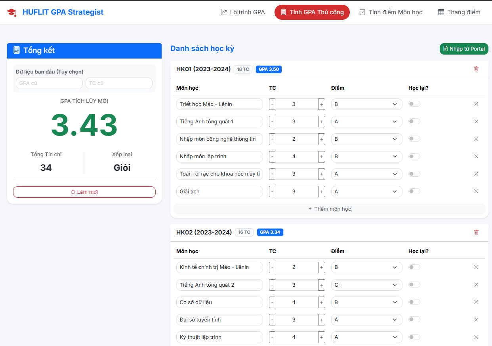
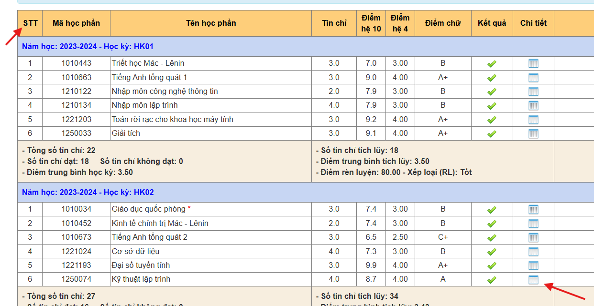
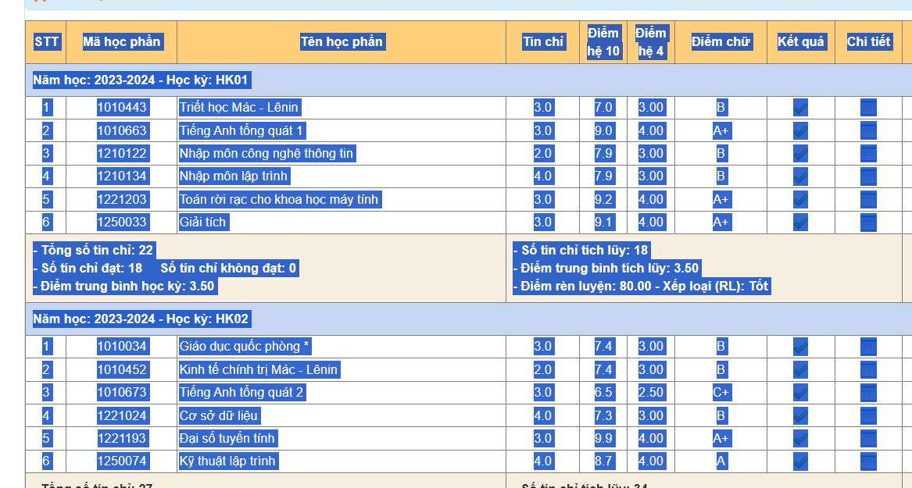
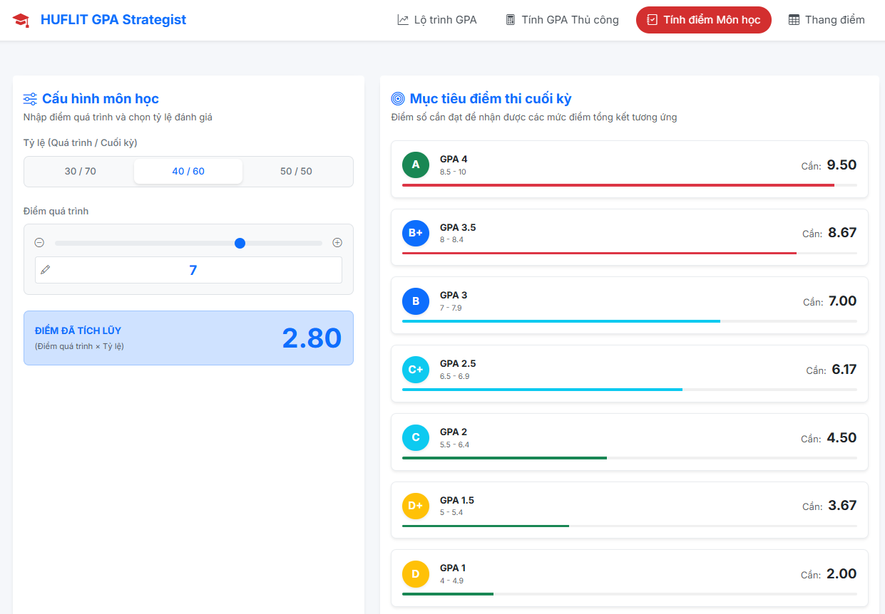
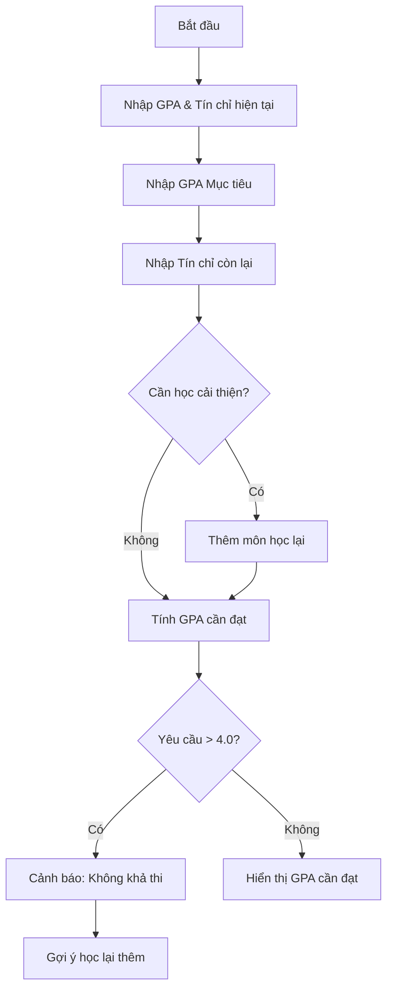
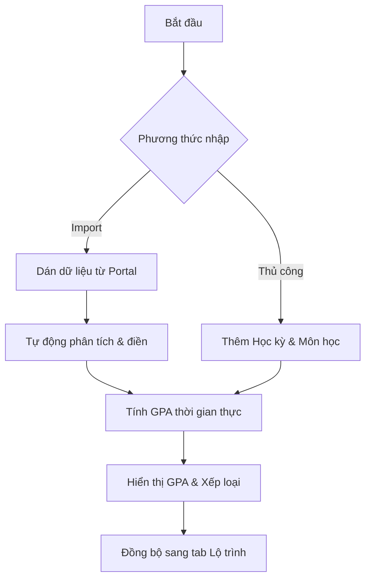
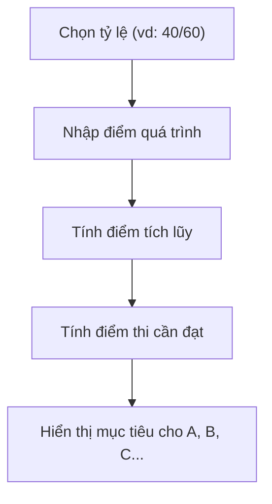

# HUFLIT GPA Strategist

Công cụ tính toán GPA và lập kế hoạch điểm số dành riêng cho sinh viên HUFLIT. Hỗ trợ import bảng điểm từ Portal đào tạo, tính toán điểm thi cuối kỳ, dự đoán GPA mục tiêu và gợi ý môn học lại thông minh.

## ✨ Tính năng chính

### 1. 🎯 Lộ trình GPA (Target GPA)
- **Dự đoán điểm số**: Tính toán chính xác điểm trung bình (GPA) bạn cần đạt được trong các tín chỉ còn lại để chạm tới mục tiêu (ví dụ: từ 3.2 lên 3.6).
- **Hỗ trợ Học cải thiện**: Tính toán kết hợp giữa việc học các môn mới và học lại các môn điểm thấp.
- **Kết quả dự báo chi tiết**:
    -  **Khả thi**: Hiển thị con số GPA cụ thể cần đạt cho mỗi môn học sắp tới.
    -  **Đã đạt**: Thông báo khi GPA hiện tại của bạn đã đủ để đạt mục tiêu mà không cần áp lực điểm số cao.
    -  **Cảnh báo**: Tự động phát hiện nếu mục tiêu quá cao (GPA yêu cầu > 4.0) hoặc khi bạn không còn đủ tín chỉ để thay đổi kết quả.
    -  **Gợi ý thông minh**: Trong trường hợp "bất khả thi", hệ thống sẽ tự động quét lịch sử học tập (từ tab Tính thủ công) và đề xuất danh sách các môn nên học lại để tối ưu hóa điểm số nhanh nhất.


*Giao diện nhập liệu và kết quả tính toán*

### 2. 📝 Tính GPA Thủ công & Import dữ liệu
- **Import thông minh**: Copy bảng điểm trực tiếp từ Portal đào tạo và dán vào công cụ. Tự động nhận diện tên môn, số tín chỉ và điểm số.
- **Quản lý chi tiết**: Quản lý điểm số theo từng học kỳ, tính GPA tích lũy và GPA từng kỳ theo thời gian thực.
- Chuyển dữ liệu sang tab "Lộ trình GPA" để lập kế hoạch.



#### Hướng dẫn Import từ Portal
1. Truy cập Portal đào tạo, vào phần Kết quả học tập.
2. Bôi đen và copy toàn bộ bảng điểm.
3. Dán vào công cụ để tự động nhập.




### 3. 📊 Tính điểm Môn học (Course Grade)
Tính toán điểm thi cuối kỳ cần đạt dựa trên điểm quá trình và tỷ lệ phần trăm.



### 4. 📋 Thang điểm chuẩn HUFLIT
- Tích hợp sẵn thang điểm quy đổi (A, B+, B, C+...) theo quy chế mới nhất.
- Phân loại học lực dựa trên GPA tích lũy.

### 5. 🌙 Chế độ tối/sáng
- Chuyển đổi giữa giao diện sáng và tối.
- Lưu trữ tùy chọn trong trình duyệt.

### 6. 📖 Hướng dẫn sử dụng tích hợp
- Modal hướng dẫn chi tiết cho từng tab.
- Tự động hiển thị lần đầu truy cập.
- Yêu cầu xác nhận để đóng.

### 7. 📱 Responsive Design
- Tương thích hoàn toàn với mobile và desktop.
- Giao diện tối ưu cho từng kích thước màn hình.

## 🔄 Luồng hoạt động chính

### 1. Tính toán Lộ trình GPA (Target GPA)



### 2. Nhập liệu & Tính GPA Thủ công



### 3. Dự báo điểm thi (Course Grade)



## 🛠 Công nghệ sử dụng

- **Frontend**: HTML5, CSS3 (Bootstrap 5.3)
- **JavaScript**: Vanilla JS (không framework)
- **Storage**: LocalStorage cho dữ liệu cá nhân
- **Icons**: Bootstrap Icons
- **Fonts**: Google Fonts (Inter)
- **Responsive**: Bootstrap Grid System

## 🚀 Cách sử dụng

1. Mở file `index.html` trong trình duyệt hoặc truy cập [trang web đã deploy](https://tienxdun.github.io/HUFLIT_GPA_Strategist/).
2. Chọn tab chức năng trên thanh điều hướng.
3. Nhập dữ liệu và xem kết quả tức thì.
4. Sử dụng nút chuyển đổi theme để thay đổi giao diện.
5. Nhấn vào avatar để xem thông tin liên hệ và hướng dẫn.

## 📂 Cấu trúc dự án

```
HUFLIT_GPA_Strategist/
├── index.html          # Giao diện chính
├── script.js           # Logic ứng dụng
├── style.css           # Styling tùy chỉnh
├── constants.js        # Dữ liệu thang điểm
├── manifest.json       # PWA manifest
├── 404.html            # Trang 404
├── LICENSE             # Giấy phép
├── README.md           # Tài liệu này
├── images/             # Hình ảnh và icon
└── favicon.ico         # Icon trang web
```

## 🤝 Đóng góp

Mọi đóng góp đều được chào đón! Vui lòng tạo issue hoặc pull request trên GitHub.

## 📞 Liên hệ

- **Tác giả**: Tiến Dũng 
- **Facebook**: [tienxdun](https://www.facebook.com/tienxdun/)
- **GitHub**: [TienxDun](https://github.com/TienxDun)

---

*Công cụ này được phát triển với mục đích hỗ trợ học tập cho các sinh viên trường Đại học Ngoại ngữ - Tin học TP.HCM (HUFLIT).* 

## Giấy phép

MIT License - Xem file LICENSE để biết thêm chi tiết.
