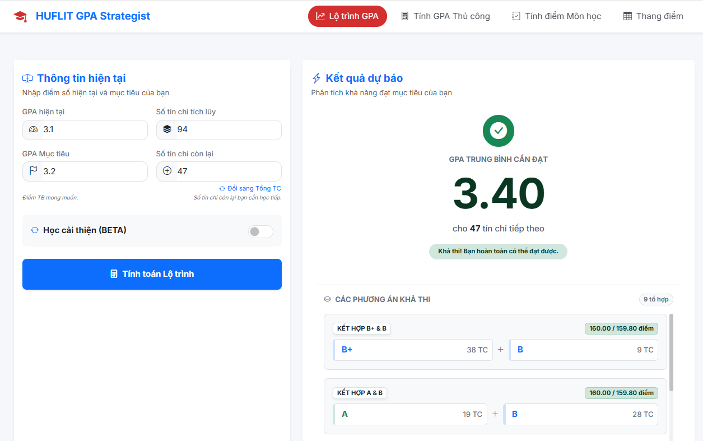
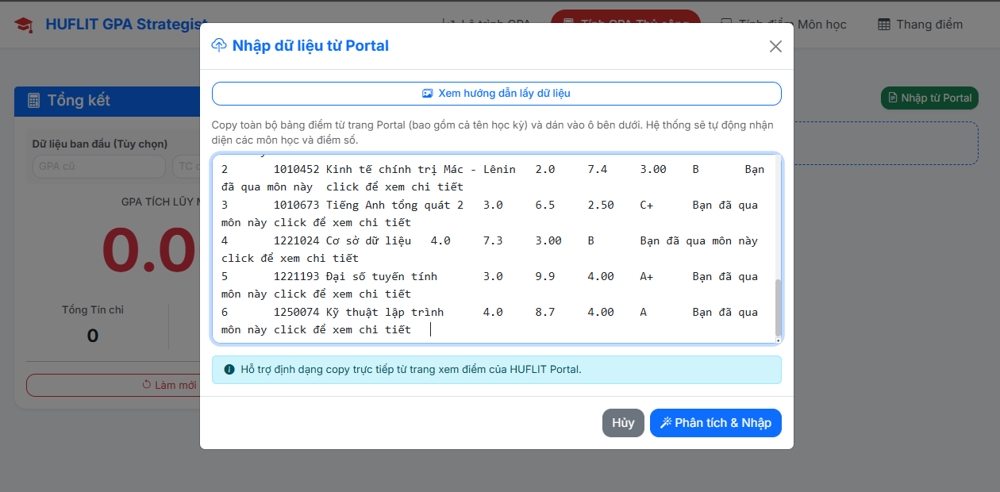

# HUFLIT GPA Strategist

Công cụ tính toán GPA và lập kế hoạch điểm số cho sinh viên HUFLIT.

## Tính năng chính

### 1. 🎯 Tính điểm môn học (Course Grade)
Tính toán điểm thi cuối kỳ cần đạt dựa trên điểm quá trình và tỷ lệ phần trăm.

### 2. 📈 Lộ trình GPA (Target GPA)
- Dự đoán điểm trung bình cần đạt cho các tín chỉ tiếp theo.
- Tự động phân tích và **gợi ý các môn cần học lại (Retake)** nếu mục tiêu quá cao so với khả năng của các môn mới.
- Hỗ trợ tính toán kết hợp giữa học mới và học cải thiện.

*Giao diện nhập liệu và kết quả tính toán*

### 3. 📝 Tính GPA thủ công & Import dữ liệu
- **Import thông minh**: Copy bảng điểm trực tiếp từ Portal đào tạo và dán vào công cụ. Tự động nhận diện tên môn, số tín chỉ và điểm số.
- **Quản lý chi tiết**: Quản lý điểm số theo từng học kỳ, tính GPA tích lũy và GPA từng kỳ theo thời gian thực.

#### Hướng dẫn Import từ Portal
1. Truy cập Portal đào tạo, vào phần Kết quả học tập.
2. Bôi đen và copy toàn bộ bảng điểm.
3. Dán vào công cụ để tự động nhập.

### 4. 📊 Thang điểm chuẩn HUFLIT
- Tích hợp sẵn thang điểm quy đổi (A, B+, B, C+...) theo quy chế mới nhất.

## Công nghệ sử dụng

- HTML5, CSS3 (Bootstrap 5)
- JavaScript (Vanilla)
- Responsive Design
- LocalStorage để lưu trữ dữ liệu cá nhân

## Cách sử dụng

1. Mở file `index.html` trong trình duyệt hoặc truy cập trang web đã deploy.
2. Chọn tab chức năng trên thanh điều hướng.
3. Nhập dữ liệu và xem kết quả tức thì.

## Giấy phép

MIT License - Xem file LICENSE để biết thêm chi tiết.
