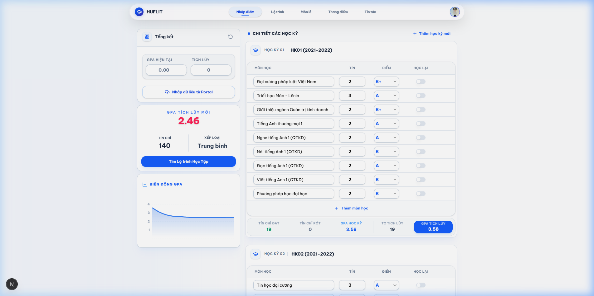
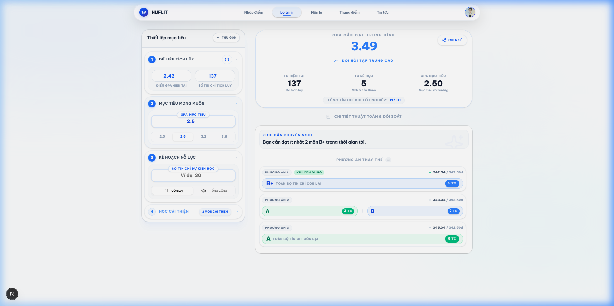
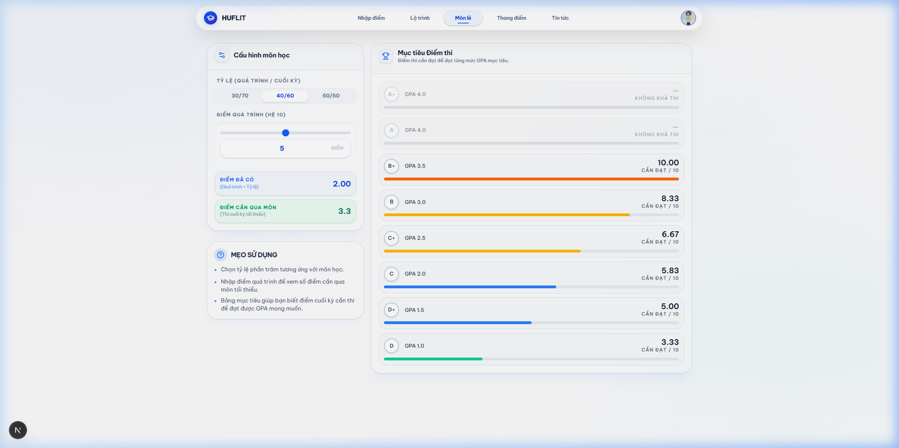
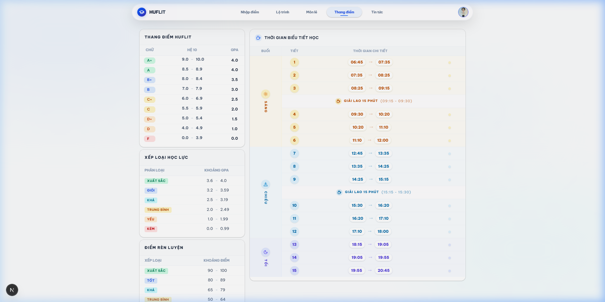

# 🎓 HUFLIT GPA Strategist

**HUFLIT GPA Strategist** là một ứng dụng web hiện đại, mạnh mẽ giúp sinh viên HUFLIT (và các trường đại học dùng thang điểm 4) tính toán GPA, quản lý bảng điểm và lập lộ trình học tập để đạt được mục tiêu học thuật mong muốn.

## 🚀 Tính năng nổi bật

- **Tính GPA thần tốc**: Hỗ trợ tính điểm theo từng học kỳ, tự động tính điểm tích lũy (Cumulative GPA).
- **Portal Import**: Tính năng độc quyền cho phép copy-paste dữ liệu từ Portal HUFLIT để nạp bảng điểm trong 1 giây.
- **Roadmap Planner**: Nhập mục tiêu GPA mong muốn, hệ thống sẽ tính toán chính xác số điểm bạn cần đạt được trong các tín chỉ còn lại.
- **Gợi ý học lại**: Tự động phân tích các môn điểm thấp và gợi ý kịch bản học cải thiện tối ưu nhất để kéo GPA lên nhanh nhất.
- **Shareable Roadmap**: Xuất lộ trình của bạn thành một liên kết ngắn gọn để lưu trữ hoặc chia sẻ với bạn bè.
- **PWA Ready**: Cài đặt ứng dụng lên màn hình điện thoại và sử dụng mượt mà như app bản địa, hỗ trợ cả khi không có mạng (Offline).
- **Trực quan hóa**: Biểu đồ theo dõi sự biến động GPA qua từng học kỳ bằng Recharts

## 🖼️ Giao diện ứng dụng

<div align="center">
  <p><i>Click vào tiêu đề để thu gọn hoặc mở rộng hình ảnh</i></p>

  <details open>
    <summary><b>📸 1. Tính GPA thủ công (Nhập điểm)</b></summary>
    
  </details>

  <br/>

  <details open>
    <summary><b>📊 2. Lộ trình GPA (Roadmap Planner)</b></summary>
    
  </details>

  <br/>

  <details open>
    <summary><b>📝 3. Tính điểm môn học (Môn lẻ)</b></summary>
    
  </details>

  <br/>

  <details open>
    <summary><b>📅 4. Thang điểm & Tiết học</b></summary>
    
  </details>
</div>

## 🛠️ Công nghệ sử dụng

Dự án được xây dựng trên những công nghệ tiên phong nhất năm 2025:

- **Framework**: [Next.js 16](https://nextjs.org/) (App Router) & [React 19](https://react.dev/)
- **Styling**: [Tailwind CSS v4](https://tailwindcss.com/) (Engine mới nhất, hiệu suất cực cao)
- **Animation**: [Framer Motion 12](https://www.framer.com/motion/)
- **Charts**: [Recharts](https://recharts.org/)
- **UI Components**: [Shadcn/ui](https://ui.shadcn.com/) & [Base UI](https://base-ui.com/)
- **Icons**: [Lucide React](https://lucide.dev/)
- **Analytics**: [GoatCounter](https://www.goatcounter.com/) (Riêng tư & nhẹ nhàng)

## 📦 Cài đặt & Chạy ứng dụng

Để chạy dự án ở môi trường local, bạn cần máy tính đã cài đặt [Node.js](https://nodejs.org/) (Khuyến nghị bản LTS mới nhất).

1. **Clone repository**:

   ```bash
   git clone https://github.com/TienxDun/HUFLIT_GPA_Strategist.git
   cd UI_enhanced
   ```
2. **Cài đặt dependencies**:

   ```bash
   npm install
   ```
3. **Chạy môi trường phát triển**:

   ```bash
   npm run dev
   ```
4. **Build dự án**:

   ```bash
   npm run build
   ```

## 🏗️ Cấu trúc thư mục

```text
src/
├── app/            # Next.js App Router (Pages, Layouts)
├── components/     # UI Components phân theo chức năng
│   ├── features/   # Các tab tính năng chính (Scale, Subject, Manual, Roadmap)
│   ├── layout/     # Header, Nav, Footer
│   └── ui/         # Shadcn base components
├── hooks/          # Custom hooks (useManualGPA, useRoadmapState...)
├── lib/            # Tiện ích & Engine tính toán GPA
└── __tests__/      # Unit tests với Vitest
```

## 📄 Giấy phép

Dự án được phát triển bởi **TienxDun**. Vui lòng ghi nguồn khi sử dụng hoặc tham khảo mã nguồn.

---

*Developed with ❤️ for HUFLIT Students.*
